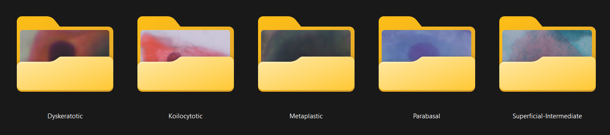

Following the notebook, the cropped images can be extracted into a folder along with their corresponding labels, using the *archive.zip* file downloaded from the original dataset available on Kaggle: [Kaggle Dataset - Cervical Cancer Largest Dataset (SipakMed)](https://www.kaggle.com/datasets/prahladmehandiratta/cervical-cancer-largest-dataset-sipakmed)
